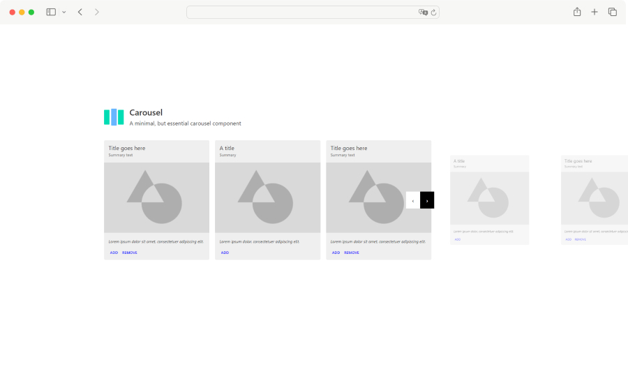

# Carousel

An example of a carousel for you to take and use as you wish in your projects.

[Demo](https://hellraiserrob.github.io/carousel/)

## Features

- Vanilla Typescript
- Light & Responsive
- Use in your projects or as learning material
